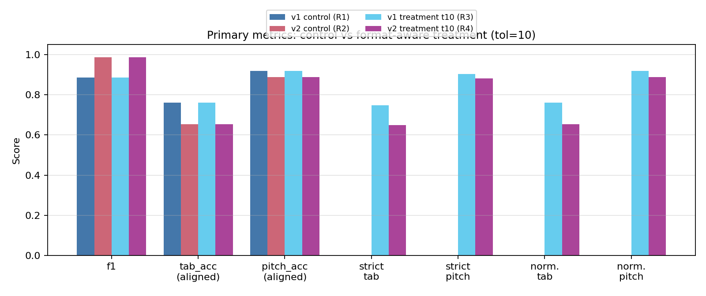
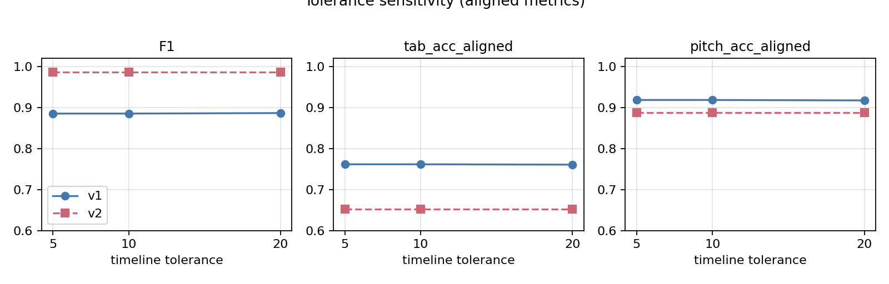
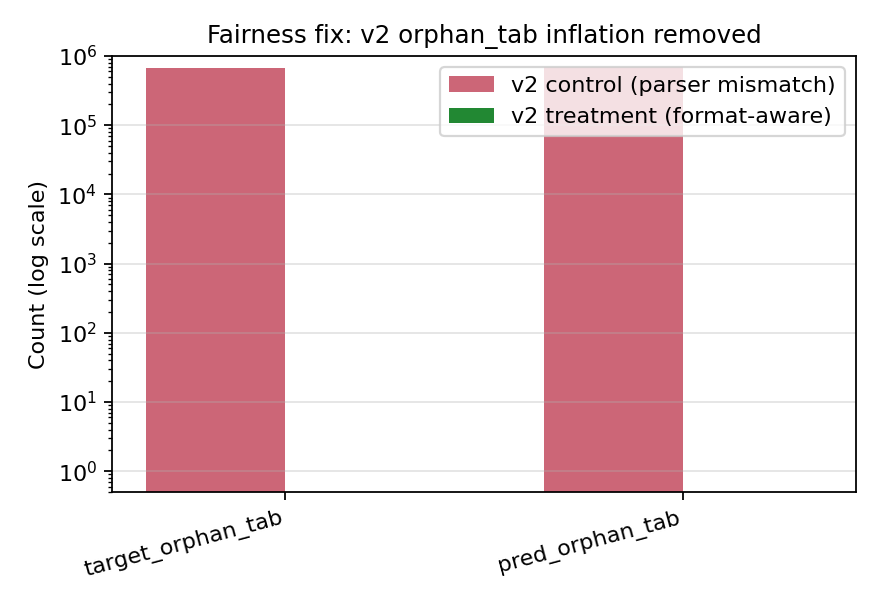
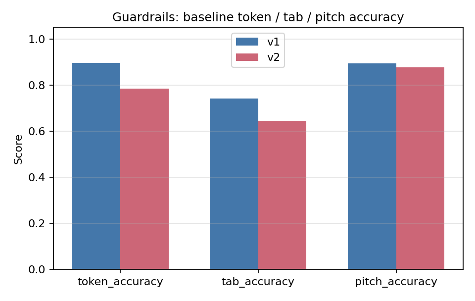

# 實驗報告：v1/v2 Token 文法錯誤、公平性與準確度

## 實驗進度
- [x] 1. 目標與範圍已定義
- [x] 2. 假設與成功準則已定義
- [x] 3. 實驗方法與對照已設計
- [x] 4. 變更計畫與執行矩陣已定案
- [x] 5. 執行與記錄已完成
- [x] 6. 資料品質檢查已通過
- [x] 7. 分析與詮釋已完成
- [x] 8. 最終整合報告已交付

## 1. 目標
- **待決策問題**：在文法／結構錯誤條件下，v1 與 v2 token 格式何者較穩；以及目前評估是否跨格式公平。
- **範圍**：僅推論、使用既有 checkpoint（不重訓），包含 parser／評估公平性修正與敏感度實驗。
- **限制**：固定測試切分、固定 checkpoint、Slurm 執行、可重現的產物輸出。

## 2. 實驗設計
- **假設**：
  - H1：格式感知 parsing 可消除 v2 文法被系統性過度懲罰的現象（`orphan_tab` 膨脹），使跨格式比較公平。
  - H0：即使修正 parser，公平性問題仍在，v2 文法計數仍偏誤。
- **方法**：
  - 設計類型：離線基準測試 + 強健性敏感度。
  - 對照組：既有 robust 報告（`analysis_report_robust`）之 v1／v2。
  - 實驗處置：
    - T1：robust 指標內使用格式感知 parser。
    - T2：雙軌指標（strict + normalized）。
    - T3：時間軸容許度敏感度（`5/10/20`）。
- **指標**：
  - Aligned：`coverage`、`precision`、`f1`、`tab_acc_aligned`、`pitch_acc_aligned`。
  - Strict 軌：`strict_tab_acc`、`strict_pitch_acc`、`syntax_penalty_pred`、`strict_tab_score`、`strict_pitch_score`。
  - Normalized 軌：`valid_event_ratio_target/pred`、`normalized_tab_acc`、`normalized_pitch_acc`。
  - 守門欄位（baseline）：`token_accuracy`、`tab_accuracy`、`pitch_accuracy`。
  - 公平性檢查：`syntax_issues` 與每千 token／事件的標準化 issue 率。
- **成功準則**：
  - C1：v2 不再因格式不符而出現病態的 `orphan_tab` 膨脹。
  - C2：strict 與 normalized 雙軌皆可用，且跨容許度穩定。
  - C3：每次執行皆產出完整產物（`robust_metrics.json`、`syntax_issue_summary.txt`、`sample_diagnostics.jsonl`、`baseline_metrics.txt`）。

## 3. 實作與執行
- **變更計畫**：
  - `src/robust_alignment_metrics.py`
    - 依 `output_format` 調整時間軸 parser 行為。
    - 對 `v2`：無 `pending NOTE_ON` 的 `TAB` 依定義不再標成 orphan。
    - 新增 strict／normalized 指標與 syntax penalty 契約。
    - 新增每千 token／事件的文法率。
  - `analyze_output_robust.py`
    - 將 Hydra 設定的 `output_format` 傳入 robust 指標計算。
    - 印出／寫入 strict + normalized 區塊與每千 issue 區塊。
  - `scripts/slurm/run_analysis_matrix_v1_v2.sh`
    - 批次矩陣：`v1/v2` × 容許度 `5/10/20`。
  - `scripts/analysis.sh`
    - 改以 `sbatch` 作為長時程分析入口。
- **範圍外（不變更）**：
  - 不重訓模型。
  - 不改 checkpoint。
  - 不改測試切分。
- **回復策略**：
  - 保留對照報告（`analysis_report_robust`）不動，與新實驗組報告對照。

### 執行矩陣
| Run ID | 變體 | Seed | 資料切分 | 主要參數 | 環境 |
|---|---|---|---|---|---|
| R1 | v1 對照 | 42 | `data_splits/test_files.json` | 原始 robust | 既有輸出 |
| R2 | v2 對照 | 42 | `data_splits/test_files.json` | 原始 robust | 既有輸出 |
| R3 | v1 實驗組 | 42 | `data_splits/test_files.json` | format-aware，tol=10 | Slurm |
| R4 | v2 實驗組 | 42 | `data_splits/test_files.json` | format-aware，tol=10 | Slurm |
| R5 | v1 實驗組 | 42 | `data_splits/test_files.json` | format-aware，tol=5 | Slurm |
| R6 | v2 實驗組 | 42 | `data_splits/test_files.json` | format-aware，tol=5 | Slurm |
| R7 | v1 實驗組 | 42 | `data_splits/test_files.json` | format-aware，tol=20 | Slurm |
| R8 | v2 實驗組 | 42 | `data_splits/test_files.json` | format-aware，tol=20 | Slurm |

### 可重現性紀錄
- Commit：`3b9799eaeb289b8000beffda54faa5f2375c88e4`
- Slurm 作業：`896191`（狀態：COMPLETED）
- 主要 sbatch 指令：
  - `sbatch scripts/slurm/run_analysis_matrix_v1_v2.sh`
- 腳本內 Slurm 執行環境：
  - `module load miniconda3`
  - `module load cuda`
  - `conda activate MusicFinal`
- 日誌：
  - `logs_inference/slurm-896191-analysis-v1v2.out`

## 4. 結果

### 4.1 公平性修正驗證（關鍵）
- v2 對照組（`R2`）存在 parser 不一致造成的假現象：
  - `target_orphan_tab=681228`，`pred_orphan_tab=690956`。
- v2 實驗組（`R4`）經格式感知修正後：
  - `target_orphan_tab=0`，`pred_orphan_tab=0`。
- **詮釋**：先前 v2「文法錯誤膨脹」多半來自指標定義／parser 假設，而非模型行為本身。

### 4.2 主要指標彙總
| Run | f1 | tab_acc_aligned | pitch_acc_aligned | strict_tab_acc | strict_pitch_acc | normalized_tab_acc | normalized_pitch_acc |
|---|---:|---:|---:|---:|---:|---:|---:|
| R1（v1 對照） | 0.885426 | 0.761614 | 0.918570 | N/A | N/A | N/A | N/A |
| R2（v2 對照） | 0.985960 | 0.652677 | 0.888020 | N/A | N/A | N/A | N/A |
| R3（v1，t10） | 0.885426 | 0.761614 | 0.918570 | 0.748219 | 0.902415 | 0.761614 | 0.918570 |
| R4（v2，t10） | 0.985960 | 0.652677 | 0.888020 | 0.648108 | 0.881803 | 0.652677 | 0.888020 |
| R5（v1，t5） | 0.885426 | 0.761614 | 0.918570 | 0.748219 | 0.902415 | 0.761614 | 0.918570 |
| R6（v2，t5） | 0.985960 | 0.652677 | 0.888020 | 0.648108 | 0.881803 | 0.652677 | 0.888020 |
| R7（v1，t20） | 0.886664 | 0.760733 | 0.917525 | 0.748399 | 0.902648 | 0.760733 | 0.917525 |
| R8（v2，t20） | 0.985960 | 0.652677 | 0.888020 | 0.648108 | 0.881803 | 0.652677 | 0.888020 |

### 4.3 守門欄位（Baseline）
| 變體 | token_accuracy | tab_accuracy | pitch_accuracy |
|---|---:|---:|---:|
| v1 | 0.897840 | 0.741549 | 0.894097 |
| v2 | 0.786085 | 0.644627 | 0.878036 |

### 4.4 統計信心／穩定性
- 本批次無重複 seed，故不報告正式信賴區間。
- 容許度敏感度作為穩定性代理：
  - v2：在 `5/10/20` 下實質不變。
  - v1：變動極小（`t20` 時 `f1` 約 `+0.0012`）。
- 實驗組中 `valid_event_ratio_target/pred` 維持 `1.0`，表示在目前定義下事件流可被 parser 視為有效。

### 4.5 圖表產物

數值來源（與上表一致）：

- `outputs/2026-04-17_15-16-inference-cmb_v1/analysis_report_robust_formataware_t10/robust_metrics.json`
- `outputs/2026-04-17_15-16-inference-cmb_v2/analysis_report_robust_formataware_t10/robust_metrics.json`
- 兩種變體對應的 `t5`／`t20` 產物

以下圖表由 `scripts/plot_experiment_report_v1_v2_grammar.py` 依本報告內嵌表格資料產生，輸出於 `docs/figures/experiment_v1_v2_grammar/`。

#### 主要指標（對照組 vs 實驗組 t10）

對照 §4.2：對照組（R1/R2，無 strict／normalized）與格式感知實驗、tol=10（R3/R4）之 `aligned` + `strict` + `normalized`。



#### 容許度敏感度（aligned）

對照 §4.2 R5–R8：`f1`、`tab_acc_aligned`、`pitch_acc_aligned` 在容許度 5/10/20 下，v1 僅輕微變動，v2 數值不變。



#### 公平性：v2 `orphan_tab` 修正前後

對照 §4.1：v2 對照組之 `target_orphan_tab`／`pred_orphan_tab` 與 v2 實驗組修正後（對數座標）。



#### 守門欄位 baseline（§4.3）



重現指令（需在 `MusicFinal` 環境）：

```bash
ml miniconda3
conda activate MusicFinal
python scripts/plot_experiment_report_v1_v2_grammar.py
```

## 5. 錯誤分析
- **失敗型態**：
  - v2 先前看似「文法無效」，實因 parser 假設不一致（例如要求輸出端需有 NOTE_ON 才配 TAB）。
  - 修正後文法膨脹消失，但與 v1 的 tab／pitch 差距仍在。
- **邊界情況**：
  - 目前觀察分佈下 strict 懲罰偏低（v2 的 `syntax_penalty_pred` 接近零）。
  - 表示在現有權重下，strict 分數仍主要由原始準確度主導。
- **可能成因（推測）**：
  - v2 表示法在輸出端淡化了明確的 NOTE_ON 音高，可能使 tab 正確性更難達成，儘管時間對齊強（`f1` 高）。
  - 高 `f1` 搭配較低 tab／pitch，顯示「時間對齊品質」不足以代理「音樂正確性」。

## 6. 結論
- **假設狀態**：
  - H1 成立：格式感知 parser 修正了跨格式的公平性假現象（`orphan_tab` 膨脹已排除）。
  - H0 在目前資料下不成立。
- **實務影響**：
  - 在 strict 與 normalized 軌上，v1 於 tab／pitch 正確性仍較佳。
  - v2 維持極高的對齊 F1，但音樂正確性相關指標較低。
- **風險與限制**：
  - 僅單一 seed、僅推論比較；無重訓層級的變異分析。
  - strict 懲罰權重為啟發式，可能低估部分文法失敗。

## 7. 後續行動
- **建議決策**：
  - 預設採雙軌報告（`aligned + strict + normalized`），勿以單一 F1 排序模型。
  - 若以譜面準確度為優先，在目前 checkpoint 下可偏向 v1。
- **後續實驗**：
  1. 懲罰係數掃描（`0.5x/1.0x/2.0x`）以檢驗排序穩健性。
  2. 重複 seed 推論／bootstrap 為 strict 與 normalized 指標建立區間。
  3. 針對 v2 新增依輸入 NOTE_ON 流的骨架一致性指標。
- **最小可行待辦**：
  1. 將現有指標契約凍結並寫入文件。
  2. （已完成）`scripts/plot_experiment_report_v1_v2_grammar.py` 依報告數值重繪圖；可再擴充為直接讀取 `robust_metrics.json`。
  3. 決定部署時的排序規則（建議：加權多指標分數，而非僅 F1）。
